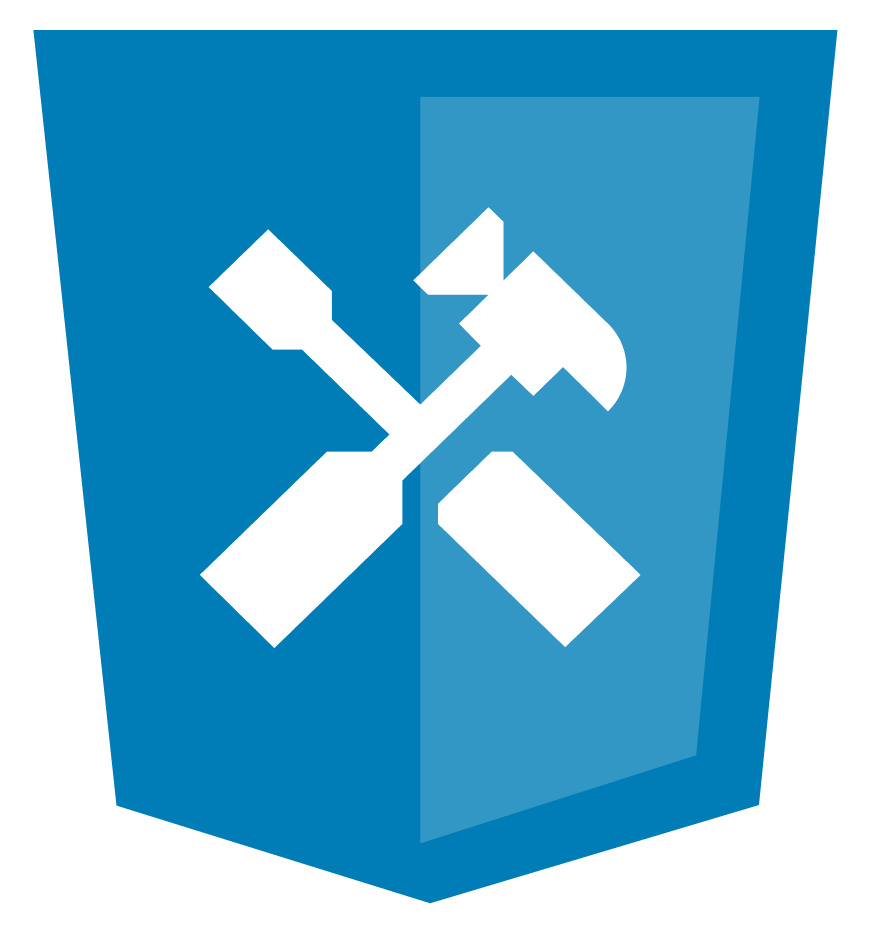

<p align="center">
  
</p>

<h1 align="center">@cliui/devtools</h1>

<p align="center">
  <a href="https://github.com/olavoasantos/cliui/blob/latest/docs">Documentation</a> •
  <a href="https://github.com/olavoasantos/cliui/blob/latest/CONTRIBUTING.md">Contributing</a> •
  <a href="https://github.com/olavoasantos/cliui/blob/latest/CODE_OF_CONDUCT.md">Code of Conduct</a>
</p>

<p align="center">
  
  
  
</p>

## About

`@cliui/devtools` will provide a Chrome DevTools Protocol (CDP) bridge for `@cliui/terminal`. It will let you inspect and edit terminal UIs using Chrome DevTools — DOM tree inspection, CSS editing, element highlighting, console forwarding, and performance profiling — all over a WebSocket connection.

> **Status:** This package is scaffolded but not yet implemented. It will be built in a future milestone.

### Planned features

- **DOM domain** — tree inspection, live mutations, inline editing
- **CSS domain** — matched styles, computed styles, stylesheet editing
- **Runtime domain** — `$0`, `evaluate()`, object inspection
- **Overlay domain** — box-model highlighting in the terminal
- **Performance domain** — frame metrics, `performance.measure()` forwarding
- **Log domain** — `console.log` / `warn` / `error` forwarding

## Usage

```shell
pnpm install @cliui/devtools
```

## Contributors

- [Olavo Amorim Santos](https://github.com/olavoasantos)
