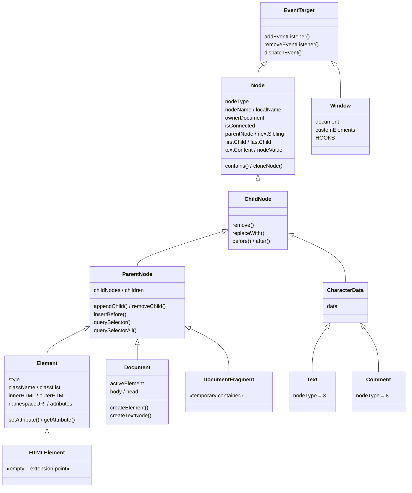

# DOM Architecture and Class Hierarchy

## The problem

@cliui/dom exports a lot of classes: `EventTarget`, `Node`, `ChildNode`, `ParentNode`, `Element`, `HTMLElement`, `Text`, `Comment`, `Document`, `DocumentFragment`, plus a handful of specialized element classes like `HTMLDialogElement` and `SVGElement`. If you've used the browser DOM, these names are familiar — but the relationships between them determine what you can _do_ with any given node.

The class hierarchy is a **capability stack**. Each class in the chain adds one responsibility. Where a node sits in the hierarchy determines which methods it has, which properties it exposes, and what role it plays in the tree. Understanding the stack means you can look at any node and know its capabilities without checking the docs.

The hierarchy forks at `ChildNode` into two branches: one for nodes that can contain other nodes (the `ParentNode` → `Element` path), and one for nodes that hold text data (the `CharacterData` → `Text`/`Comment` path). `Document`, `DocumentFragment`, and `Window` plug into this hierarchy at specific points.



The rest of this document walks through each layer, explains the fork, and covers the practical questions: what does `createElement` give you back? Why is `HTMLElement` empty? What's the Document skeleton? Why are Symbols everywhere?

## The capability stack

### EventTarget — everything listens

The base of the stack. `addEventListener`, `removeEventListener`, `dispatchEvent`. Every object in the DOM that can participate in events inherits from `EventTarget` — elements, text nodes, the document, and the window.

`Window` extends `EventTarget` directly. It's _not_ a `Node` — it doesn't sit in the DOM tree, has no `parentNode`, no `nodeType`. But it can receive events, which is why `window.addEventListener('error', handler)` works.

### Node — existing in the tree

`Node` adds identity, ownership, and position.

**Identity:** `nodeType` is a numeric code that tells you what kind of node this is. Elements are `1`, text nodes are `3`, comments are `8`, documents are `9`. `nodeName` is the uppercase tag name for elements (`'DIV'`, `'SPAN'`) or a fixed string for other types (`'#text'`, `'#comment'`, `'#document'`). `localName` is the lowercase version of the tag name.

**Ownership:** `ownerDocument` points to the `Document` this node belongs to. Every node gets this when it's created — it's how the node finds its way back to the document's factory methods and the hooks bridge.

**Connectivity:** `isConnected` is `true` when the node is part of a document-rooted tree (attached to the skeleton via `appendChild` or similar), `false` when it's detached. This flag propagates — appending a parent to the document connects all its descendants. Removing it disconnects them all.

**Traversal:** `parentNode`, `nextSibling`, `previousSibling`, `firstChild`, `lastChild` let you walk the tree in any direction. `nextElementSibling` and `previousElementSibling` skip over non-element nodes (text, comments) to find the next element.

**Content:** `textContent` reads by concatenating all descendant text nodes. Writing to `textContent` replaces all children with a single text node — except when the node already has exactly one text child, in which case it updates that child in place (avoiding unnecessary tree mutations).

Node is read-only with respect to the tree structure. You can _traverse_ the tree from a Node, but you can't _modify_ it — there's no `appendChild` or `removeChild` here. Those come later.

### ChildNode — detaching yourself

`ChildNode` adds four self-directed mutation methods: `remove()`, `replaceWith()`, `before()`, and `after()`. These operate on the node itself relative to its parent — "remove _me_ from my parent," "put this element _before me_."

This is the last shared class before the hierarchy forks. From `ChildNode`, two branches diverge — and they never rejoin.

## The fork

At `ChildNode`, the hierarchy splits into two branches. This split reflects a fundamental distinction in the DOM: some nodes **contain** other nodes, and some nodes **carry data**.

### The ParentNode branch — containers

`ParentNode` extends `ChildNode` and adds the ability to have children. This is where tree-building methods live:

- **Mutation:** `appendChild`, `insertBefore`, `removeChild`, `replaceChild`, `append`, `prepend`, `replaceChildren`
- **Queries:** `querySelector(selector)`, `querySelectorAll(selector)`
- **Child collections:** `childNodes` (all node types) and `children` (elements only)

`Element` extends `ParentNode` and adds everything that makes an element an element:

- **Attributes:** `setAttribute`, `getAttribute`, `removeAttribute`, `hasAttribute`, plus the `attributes` NamedNodeMap
- **Styles:** the `style` property returns a `CSSStyleDeclaration` (created lazily on first access)
- **Classes:** `className` (string) and `classList` (DOMTokenList with `add`, `remove`, `toggle`, `contains`)
- **Namespace:** `namespaceURI` (XHTML by default, SVG when created via `createElementNS`)
- **Serialization:** `innerHTML` (read: serialize children, write: parse HTML and replace children), `outerHTML` (read-only: serialize the element and its children)
- **Node type:** `nodeType = 1` — the element node type

Element also has an open index signature (`[anyProperty: string]: unknown`), meaning you can assign arbitrary properties to any element without TypeScript errors. This matters for frameworks that set non-standard properties on DOM nodes.

`HTMLElement` extends `Element` and adds... nothing. It's an empty class. [Why it exists](#the-empty-classes) is covered below.

`DocumentFragment` also extends `ParentNode` — not `Element`. It can hold children and be queried with `querySelector`, but has no tag name, no attributes, no styles. Its special behavior: when you `appendChild` a fragment into an element, the fragment's children are moved into the parent individually. The fragment itself doesn't enter the tree. This makes it a batch-insertion tool — build up a subtree in a fragment, then insert it in one operation.

### The CharacterData branch — data carriers

`CharacterData` extends `ChildNode` (not `ParentNode`) and adds a single property: `data`. This is where text content lives.

Two classes extend `CharacterData`:

- **Text** — `nodeType = 3`, `nodeName = '#text'`. Created via `document.createTextNode()`. Holds the visible text content in the DOM.
- **Comment** — `nodeType = 8`, `nodeName = '#comment'`. Created via `document.createComment()`. Holds comment strings. Serializes as `<!--content-->`.

Because `CharacterData` extends `ChildNode` and _not_ `ParentNode`, text and comment nodes:

- ✔ Can be children of an element (they're ChildNodes)
- ✔ Can remove themselves (`remove()`, `before()`, `after()`)
- ✘ Cannot have children (no `appendChild`)
- ✘ Cannot be queried (`querySelector` lives on ParentNode)
- ✘ Cannot have attributes (`setAttribute` lives on Element)

They're leaf nodes by design. The fork in the hierarchy is what enforces this.

One more node type sits outside the fork entirely: `Attr` extends `Node` directly — not `ChildNode`. Attribute nodes have `nodeType = 2` and live inside an element's `NamedNodeMap`, not in the main DOM tree. You rarely interact with `Attr` objects directly — `setAttribute`/`getAttribute` on `Element` are the standard interface.

### Surprises the fork explains

If you've hit any of these, the fork is the answer:

**"I can't call `querySelector` on a text node."** — `querySelector` lives on `ParentNode`. Text extends `CharacterData` → `ChildNode`, which is _before_ the fork. It never passes through `ParentNode`.

**"I can't `setAttribute` on a comment."** — `setAttribute` lives on `Element`. Comments extend `CharacterData` → `ChildNode`. Same reason — wrong branch.

**"`parentNode` works on a text node but `appendChild` doesn't."** — `parentNode` is a read operation on `Node` (which everything inherits). `appendChild` is a write operation on `ParentNode` (which only the container branch inherits). Reading the tree is universal. Modifying it as a parent requires being a container.

## The empty classes

Several classes in the hierarchy are empty or nearly so. This is intentional — they exist for _identity_, not behavior.

### HTMLElement — the extension point

`HTMLElement` extends `Element` and adds no methods or properties. Its purpose is to serve as the base class for custom elements:

```ts
class MyWidget extends HTMLElement {
  connectedCallback() {
    this.textContent = 'Hello from MyWidget';
  }
}

window.customElements.define('my-widget', MyWidget);
```

The custom element spec says custom elements extend `HTMLElement`. So the class must exist, even though it contributes nothing to the API surface. It's a type boundary, not a capability boundary.

### Structural elements — the instanceof surprise

`HTMLHtmlElement`, `HTMLHeadElement`, and `HTMLBodyElement` all extend `Element` directly — **not** `HTMLElement`. They're empty classes that exist solely for `instanceof` identity:

```ts
document.body instanceof Element; // true
document.body instanceof HTMLElement; // false  ← surprise
```

If you're coming from browser-land, this is unexpected. In browsers, `document.body` is an `HTMLBodyElement` which extends `HTMLElement`. Here, the structural elements were kept on the simpler `Element` branch because they predate the custom element convention and don't need anything HTMLElement would provide.

This matters when code does type checks. If a library checks `node instanceof HTMLElement` to determine whether something is "a real element," structural elements will fail that check. Use `node instanceof Element` or check `node.nodeType === 1` instead.

### Specialized subclasses that add behavior

Not all element subclasses are empty. Six built-in tag names get classes with real functionality:

| Class                 | Tag          | What it adds                                                                                         |
| --------------------- | ------------ | ---------------------------------------------------------------------------------------------------- |
| `HTMLDialogElement`   | `<dialog>`   | Modal/non-modal open/close, focus trapping, Escape-to-close, `returnValue`                           |
| `HTMLAnchorElement`   | `<a>`        | Automatic `tabindex="0"` when `href` is set, removed when `href` is removed                          |
| `HTMLStyleElement`    | `<style>`    | `sheet` property that returns the element's CSS text content                                         |
| `HTMLTemplateElement` | `<template>` | `content` property (a `DocumentFragment`), separate `innerHTML` behavior that writes to the fragment |
| `HTMLLinkElement`     | `<link>`     | `rel`, `href`, `type` property accessors, `sheet` for loaded stylesheet text                         |
| `HTMLScriptElement`   | `<script>`   | `src`, `type`, `defer`, `async` property accessors                                                   |

`SVGElement` extends `Element` with the SVG namespace and an `ownerSVGElement` property that walks up to the root `<svg>` ancestor.

`HTMLIFrameElement` is a special case — an empty stub extending `HTMLElement`. It exists because React 19 performs an `element instanceof HTMLIFrameElement` check internally. Without the class, that check throws a `TypeError`. No element in @cliui/dom will ever be an instance of it.

## The Document skeleton

When you create a `Window`, you get a complete, connected document skeleton out of the box:

```
Window (extends EventTarget)
  └─ document (Document, extends ParentNode)
       └─ <html> (HTMLHtmlElement)
            ├─ <head> (HTMLHeadElement)
            └─ <body> (HTMLBodyElement)
```

No assembly required. `document.body` is immediately usable — you can `appendChild`, set `innerHTML`, run `querySelector`, all before doing anything else.

The skeleton is connected from birth. Every node in it has `isConnected = true` from the moment the `Window` constructor finishes. The `Document` itself is permanently connected — its `isConnected` is hardcoded to `true` and never changes.

### Document — a special ParentNode

`Document` extends `ParentNode`, which means it has `appendChild`, `querySelector`, and the rest. But it has additional responsibilities unique to a document:

- **Factory methods:** `createElement`, `createTextNode`, `createComment`, `createDocumentFragment`, `createElementNS`. These are the only way to create new nodes — every node needs an owner document, and the factory methods assign it.
- **Active element tracking:** `document.activeElement` points to the currently focused element (defaults to `body`). `document.setActiveElement(element)` changes focus and dispatches the blur/focus event sequence.
- **Hover tracking:** `document.hoveredElement` and `document.setHoveredElement(element)` for hover state, used by the rendering layer to evaluate `:hover` selectors.
- **Focus cycling:** `document.focusNext()` cycles through elements with a `tabindex` attribute in document order. `document.focusNext(true)` cycles backward.
- **Node transfer:** `document.adoptNode(node)` transfers a node from another document. `document.importNode(node, deep)` clones a node into this document.

### Window — outside the tree

`Window` extends `EventTarget` — not `Node`, not `ParentNode`. It's not part of the DOM tree. It can't be appended, it has no `parentNode`, no `nodeType`.

What it does hold:

- `document` — the Document instance
- `customElements` — the `CustomElementRegistry`
- `navigator`, `location`, `performance` — web API surfaces
- `[HOOKS]` — the hooks bridge (the integration point for renderers)
- Self-references: `window.window`, `window.self`, `window.parent`, `window.top` all point back to the Window itself
- DOM class references: `window.Event`, `window.Element`, `window.Node`, etc. — frameworks sometimes access constructors via the window object

## The createElement dispatch

When you call `document.createElement(tagName)`, the tag name determines which class gets instantiated. This isn't random — it's a fixed dispatch table:

```
createElement(tagName)
  │
  ├─ 'a'        → new HTMLAnchorElement()
  ├─ 'dialog'   → new HTMLDialogElement()
  ├─ 'template' → new HTMLTemplateElement()
  ├─ 'style'    → new HTMLStyleElement()
  ├─ 'link'     → new HTMLLinkElement()
  ├─ 'script'   → new HTMLScriptElement()
  │
  ├─ (SVG namespace via createElementNS)
  │              → new SVGElement()
  │
  ├─ (registered in customElements?)
  │              → new CustomElementConstructor()
  │
  └─ (everything else)
                 → new Element()
```

Most tag names — `'div'`, `'span'`, `'section'`, `'p'`, `'button'`, `'input'` — produce a plain `Element`. They share the same class. What distinguishes a `<div>` from a `<span>` is the tag name stored in the node, not the class. `createElement('div').constructor === createElement('span').constructor` is `true`.

The specialized classes exist for tag names that need behavior beyond what Element provides. `<dialog>` needs modal open/close. `<a>` needs automatic focusability. `<template>` needs a separate content fragment. If a tag name doesn't need special behavior, it gets a generic Element.

Custom elements are checked after the built-in names. If you've called `customElements.define('my-widget', MyWidget)`, then `createElement('my-widget')` returns an instance of `MyWidget`. If the tag name isn't registered, it falls back to plain `Element`. (If you register the element _after_ creating instances with that tag name, the existing instances get upgraded via `Object.setPrototypeOf` — but that's covered in the [Custom Elements](./custom-elements.md) doc.)

Every element, regardless of which class it comes from, goes through `setupElement` after construction. This assigns the owner document, stores the tag name, sets the namespace, and fires the `hooks.createElement` callback. By the time `createElement` returns, the element is fully initialized — it has an owner, a name, and the rendering layer has been notified.

## Symbols — the internal wiring

Open a DOM node in a debugger and you'll see properties keyed by Symbols: `Symbol(parent)`, `Symbol(child)`, `Symbol(prev)`, `Symbol(next)`, `Symbol(name)`, and others. These are the internal state that makes the tree work.

### Why Symbols?

Two reasons:

**No collisions.** Elements accept arbitrary string attributes (`data-value`, `role`, `aria-label`) and arbitrary properties (frameworks set non-standard properties on DOM nodes regularly). If internal state used string keys like `_parent` or `__child`, a framework or user could accidentally overwrite them. Symbol keys are unique — no string-based access can collide with them.

**Invisible by default.** Symbol-keyed properties don't appear in `for...in` loops or `Object.keys()`. They don't leak into serialization. They're there if you know to look for them, but they don't pollute the public surface.

### Public vs. internal Symbols

Most Symbols (`NAME`, `DATA`, `ATTRIBUTES`, `STYLE`, `IS_CONNECTED`, `LISTENERS`, etc.) are internal implementation details. They're not exported from the package.

Four Symbols _are_ exported: `HOOKS`, `CHILD`, `NEXT`, and `PARENT`. These exist for consumers who need deeper access:

- **`HOOKS`** is the primary integration surface — renderers install callbacks on `window[HOOKS]` to observe DOM mutations. This is the designed public API for renderer integration, documented fully in [The Hooks Bridge](./hooks-bridge.md).
- **`CHILD`**, **`NEXT`**, and **`PARENT`** expose the linked-list structure. They're available for advanced consumers (like a rendering layer that needs to walk the tree directly), but the standard DOM traversal properties (`firstChild`, `nextSibling`, `parentNode`) are the intended public API.

The key takeaway: Symbols are how the DOM stores its internal state without interfering with user-land code. The hooks bridge is the integration surface. Direct Symbol access is possible but not the designed contract for most use cases.

## Two child structures

Every parent node maintains two parallel representations of its children:

**The linked list** uses Symbol-keyed pointers: `[CHILD]` points to the first child, each child has `[NEXT]` and `[PREV]` pointing to its siblings. Insertion and removal are O(1) — just rewrite a few pointers. The DOM's traversal properties (`firstChild`, `lastChild`, `nextSibling`, `previousSibling`) read directly from these pointers.

**The arrays** are `childNodes` (a `NodeList` containing all child nodes regardless of type) and `children` (a `NodeList` containing only element children, `nodeType === 1`). These provide indexed access: `parent.childNodes[2]`, `parent.children.length`.

Both structures are kept in sync. Every `appendChild`, `insertBefore`, and `removeChild` updates the linked list _and_ both arrays. The linked list is updated first (pointer manipulation), then the arrays are spliced to match.

Why both? The linked list is the natural structure for DOM tree-walking — `firstChild` → `nextSibling` → `nextSibling` is just pointer chasing. The arrays are what frameworks expect — React indexes into `childNodes`, and the hooks bridge reports insertion/removal indices so renderers can maintain parallel data structures. Neither alone covers both needs efficiently.

**`childNodes` vs. `children`:** If a parent has three children — a text node, a `<span>`, and a comment — `childNodes` contains all three (length 3) and `children` contains only the `<span>` (length 1). `childNodes` is the complete picture. `children` is the element-only view.

## Where to go next

- **[The Hooks Bridge](./hooks-bridge.md)** — how renderers observe DOM mutations via the `HOOKS` Symbol, the chaining contract, and coexistence with MutationObserver
- **[Custom Elements](./custom-elements.md)** — lifecycle callbacks, the upgrade mechanism, light-DOM style injection, and why there's no Shadow DOM
- **[Scope and Boundaries](./scope-and-boundaries.md)** — the full inventory of what's supported, what's not, and the reasoning behind each boundary
